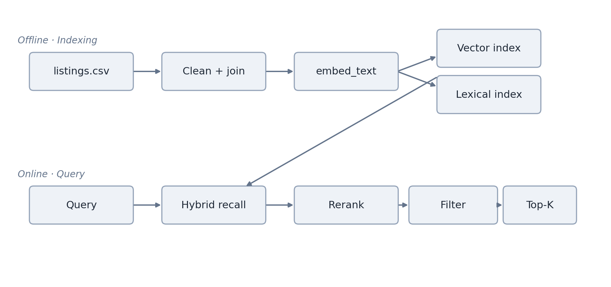
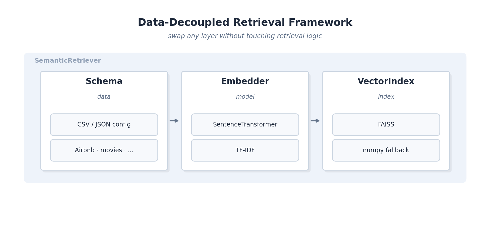
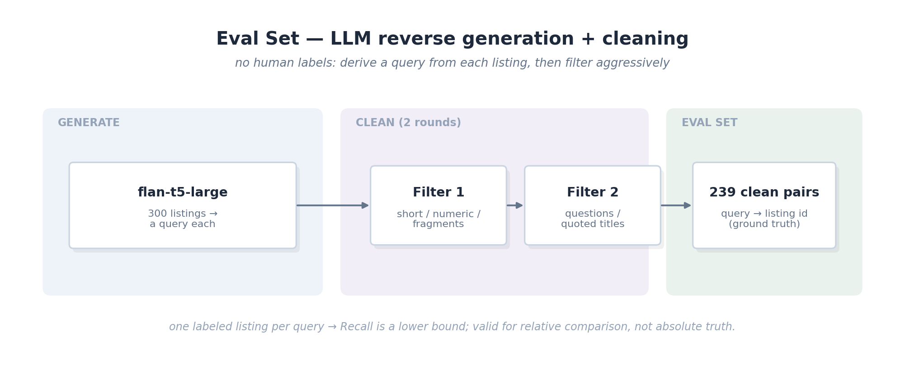
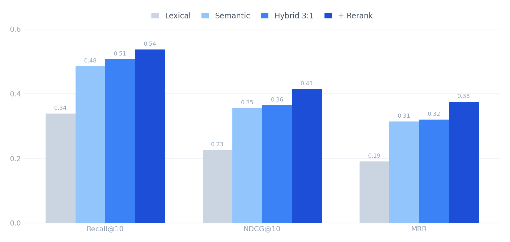
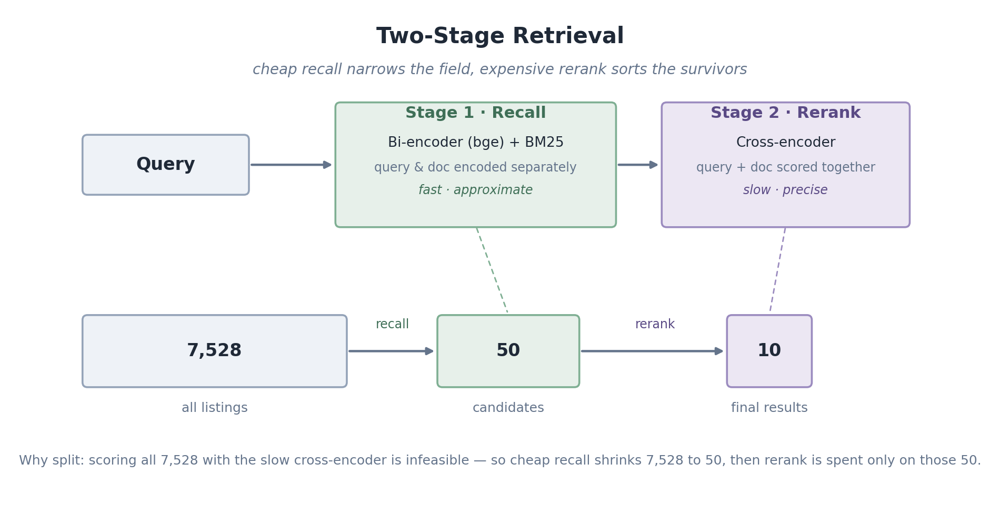
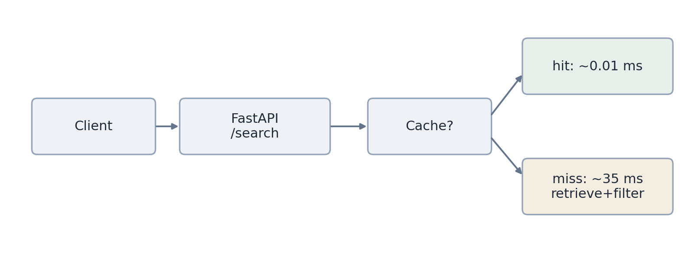

# Semantic Search & Retrieval Platform

> An end-to-end semantic search system built from scratch over Airbnb-style listing data
> (San Francisco, **7,528 listings**): data pipeline → a data-decoupled retrieval framework →
> semantic retrieval core → a full evaluation harness → hybrid fusion + cross-encoder reranking.
> Every improvement is driven by a **hypothesis → experiment → metric → decision** loop and backed by numbers.

---

## 1. Overview

A listing has both **free text** (title, description) and **structured attributes** (price, location, room type, amenities).

- **Pure keyword search (BM25 / TF-IDF)** misses intent — a query like *"quiet family home near a park"* may match listings that never use those exact words.
- **Pure vector search** loses precise signals — exact neighborhood names, hard filters (`price ≤ 200`).

**Thesis:** no single retriever is optimal. The core of the system is **hybrid fusion + reranking**, quantified by a trustworthy evaluation harness.

---

## 2. System Architecture



The **index layer is where offline and online meet** — the pipeline writes it, queries read it. The hard engineering lives in *safely updating that shared layer*, which motivates the versioning and rollback design below.

---

## 3. Data Pipeline (`prepare_listings.py`)

The raw source is Inside Airbnb's *detailed* listings (90 columns). The principle: **explore before designing** — never assume the schema.

`Raw listings.csv (90 cols, 7,528 rows)` → clean & parse → template join → `listings_prepared.csv (embed_text + filter fields)`.

| Decision | Why |
|---|---|
| Use `neighbourhood_cleansed` instead of `neighborhood_overview` | Exploration showed the latter was **100% empty** |
| Strip HTML / markdown noise from `description` | Raw text contained `<br/>`, `**`, etc. |
| Parse `amenities` JSON, keep top 20 | Listings had dozens of amenities + brand names that dilute semantics |
| Parse `price` `"$311.00"` → numeric | Strings can't support numeric filtering |
| `EMBED_TEXT_VERSION` fingerprint at the top | Changing the template/cleaning bumps the version → index rebuilds, old/new stay distinguishable |

> **Gotcha caught early:** the file's line count is inflated because `description` contains embedded newlines — the true row count is 7,528. This is exactly why you can't eyeball a CSV with `wc`/`head`.

---

## 4. Data-Decoupled Retrieval Framework (`retrieval.py`)

Three independent layers — swap any one **without touching retrieval logic**. Changing dataset, model, or index is a config change, not a rewrite.



- **Schema (data):** declares *which column is the id, which fields form the search text, which are filterable metadata*; loadable from dict/JSON.
- **Embedder (model):** `SentenceTransformerEmbedder` and `TfidfEmbedder` share one interface — a one-line switch upgrades a lexical baseline to semantic search.
- **VectorIndex (index):** FAISS when available, automatic numpy brute-force fallback (equally exact).
- **Versioning & persistence:** `Schema.version()` fingerprints *(template + model)*; `save()/load()` persists vectors, corpus, and version together.

> **Decoupling proof:** the same `SemanticRetriever` class ran two unrelated corpora — an inline *movies* dataset and the 7,528 real listings — with only the Schema swapped.

---

## 5. Semantic Retrieval Core

- **Model:** `BAAI/bge-small-en-v1.5`, with the retrieval instruction prefix on the query side (not the passage side).
- **Similarity:** normalized embeddings + FAISS `IndexFlatIP` (inner product ≡ cosine).
- **Performance:** ~**29 s** to encode all 7,528 listings on a T4 GPU.
- **Over-fetch then filter:** retrieve `k×10` candidates before metadata filtering so filters don't starve the result set.

---

## 6. Evaluation Harness — the heart of the project

### 6.1 Metrics (`evaluate.py`)

Implements **Recall@K / NDCG@K / MRR**, depending only on a retriever's `.search(query, k)` interface — so it works uniformly across lexical, semantic, hybrid, and rerank. Logic verified against a hand-computed example (a hit at rank 1 and rank 3 → Recall@5 = 1.0, MRR = 0.667, NDCG = 0.75).

### 6.2 Eval set — LLM reverse generation + cleaning

No human labels exist, so **derive queries from listings**: for each listing, an LLM writes a query a user might type; that listing's id is the ground-truth answer.



- **Generator:** `flan-t5-large` (free, local GPU, no API key).
- **Two cleaning rounds:** remove queries that are too short, number-heavy, contain raw fragments, are questions, or copy the title verbatim.
- **Scale:** 300 sampled → **239 clean queries** retained.

> **Honest methodology note:** this synthetic set labels exactly **one** relevant listing per query; other relevant listings may exist unlabeled, so **Recall is a lower bound / approximation**. It's well suited for **relative comparison** (which retriever is better), not as absolute ground truth. Because generation is stochastic (`do_sample`), absolute scores drift slightly between runs — **conclusions hold within a single table.**

---

## 7. Results — one continuous optimization chain

<p align="center">
  
</p>
<p align="center"><sub>Retrieval quality across the optimization chain (239-query eval set)</sub></p>

### Experiment A — Semantic vs Lexical (239 queries)

| retriever | Recall@10 | NDCG@10 | MRR |
|---|---|---|---|
| Lexical (TF-IDF) | 0.339 | 0.226 | 0.191 |
| **Semantic (bge)** | **0.485** | **0.355** | **0.314** |
| lift | **+43%** | **+57%** | **+64%** |

Semantic wins on all three — it both recalls more *and* ranks better.

### Experiment B — Weighted Hybrid (RRF)

| retriever | Recall@10 | NDCG@10 | MRR |
|---|---|---|---|
| Semantic (bge) | 0.485 | 0.355 | 0.314 |
| Hybrid 1:1 | 0.498 | 0.344 | 0.295 |
| Hybrid 2:1 | 0.502 | 0.358 | 0.312 |
| **Hybrid 3:1** | **0.506** | **0.364** | **0.320** |

**Key finding:** equal-weight (1:1) fusion *raised Recall but lowered NDCG/MRR below pure semantic* — because the two retrievers differ sharply in strength, the weaker lexical arm pulls its own "ranked-high but less-relevant" results up, diluting the ranking. **Only after up-weighting semantic to 3:1 do all three metrics beat pure semantic.**

### Experiment C — Cross-encoder reranking

| retriever | Recall@10 | NDCG@10 | MRR |
|---|---|---|---|
| Semantic (bge) | 0.450 | 0.340 | 0.306 |
| Hybrid 3:1 | 0.458 | 0.327 | 0.285 |
| **Hybrid 3:1 + rerank** | **0.537** | **0.414** | **0.375** |
| vs Hybrid 3:1 | **+17%** | **+27%** | **+31%** |

Two-stage: hybrid recalls top-50 → `bge-reranker-base` (cross-encoder) scores each query–listing pair → re-rank to top-10. The big NDCG/MRR jump is expected; **Recall@10 also rises** because reranking lifts correct listings that the recall stage had under-ranked *out of* the top-10 back *into* it.

> Experiment C's baseline differs slightly from A/B due to eval-set stochasticity (§6.2) — table-internal comparisons remain valid.

---

## 8. Two-Stage Retrieval (recall → rerank)



A bi-encoder (bge) encodes query and listing *separately* — fast but coarse, ideal for scanning all 7,528. A cross-encoder feeds *query + listing together* — precise but expensive, so it only runs on the 50 survivors. This **cheap-recall + expensive-rerank** funnel is the industry-standard two-stage pattern.

---

## 9. Key Engineering Decisions & Lessons

1. **Explore before designing.** Found `neighborhood_overview` fully empty, `price` stored as a string, `description` full of HTML — the join template and filters were shaped by the real data, not assumptions.
2. **The statistics trap in evaluation.** On a tiny eval set (~a dozen queries), semantic and lexical *tied*; scaled to 239, semantic won by 43%. **Small-sample conclusions are not trustworthy.**
3. **Detecting & fixing eval bias.** First-pass LLM queries leaked the listing's own words, biasing toward lexical; two cleaning rounds made the comparison fair.
4. **Weighted RRF.** When two retrievers differ sharply in strength, equal-weight fusion is dragged down by the weaker one — solved via weight tuning (3:1).
5. **Understanding metric semantics.** A cross-encoder doesn't enlarge the candidate pool yet still lifts Recall@K — by re-ranking under-rated correct answers into the top-K.

> These *find a problem → diagnose → tune* narratives demonstrate real understanding of retrieval systems far better than any single headline number.

---

## 10. Tech Stack

- **Retrieval / models:** sentence-transformers (`bge-small-en-v1.5`), `bge-reranker-base`, FAISS, scikit-learn (TF-IDF)
- **Data:** pandas, numpy, Inside Airbnb (SF) listings
- **Eval-set generation:** Transformers (`flan-t5-large`)
- **Language / env:** Python, Google Colab (T4 GPU)

```
semantic-search/
├── prepare_listings.py   # explore + clean + multi-field join (+ versioning)
├── retrieval.py          # framework: Schema / Embedder / VectorIndex / filter / persistence
├── evaluate.py           # Recall@K / NDCG@K / MRR + compare()
├── demo.py               # end-to-end search example
├── service.py            # FastAPI serving layer: /search /health /version /reload
├── cache.py              # thread-safe TTL + LRU result cache
├── benchmark.py          # concurrent load test → P50/P95/P99 + QPS
├── listings_prepared.csv # processed corpus (embed_text + structured fields)
└── assets/results.png    # results chart
```

---

## 11. Production Serving Layer

The retrieval pipeline is wrapped as an HTTP service — turning a *model* into a *system*.



**Endpoints**
- `GET /search` — retrieval + metadata filters (price / room type / area); response carries `version`, `cached`, `latency_ms`.
- `GET /health`, `GET /version` — liveness + active index version + cache stats.
- `POST /reload` — atomic hot-swap of the serving index; **rollback = reload the previous version**.

**Caching.** A thread-safe TTL + LRU cache keyed by `(query, k, filters, version)` skips embedding + retrieval on repeats. In-memory by design (zero-dependency, fastest for a single process); a shared multi-process deployment would swap in Redis behind the same interface.

**Versioning & rollback.** Each served index carries a version fingerprint `(template + model)`; the engine reference is swapped under a lock so in-flight requests are unaffected. The cache key includes the version, so a reload invalidates stale entries automatically.

### Measured results (single process, TF-IDF engine)

| Metric | Value |
|---|---|
| Cache **miss** latency (single) | ~35 ms |
| Cache **hit** latency (single) | ~0.01 ms (≈3,500× faster) |
| Throughput (32 concurrent) | **521 QPS** |
| P50 / P95 / P99 | 55 / 95 / 107 ms |
| Cache hit rate (load test) | 98.8% |

**Bottleneck analysis.** Despite a 98.8% cache hit rate, end-to-end P95 stayed at ~95 ms — far above the 0.01 ms single-call cache lookup. The gap is **not** the cache: under 32 concurrent requests, a single Uvicorn process (and Python's GIL) serializes work, so requests queue. The 0.01 ms figure measures the cache lookup in isolation; the 55 ms P50 measures end-to-end latency under contention. **The bottleneck is concurrency, not retrieval.** The fix is horizontal scaling (`--workers N`), which also surfaces the next trade-off: per-process caches no longer share state — exactly the case where a shared Redis cache earns its keep.

---

## 12. Roadmap

- **Scale-out** — multi-worker / multi-replica serving; shared **Redis** cache once caches must be coherent across processes
- **Semantic in production** — serve the `bge` + reranker pipeline behind the same API (env switch already wired)
- **Cost** — per-1k-query cost: embedding + index + rerank
- **Deploy & rollback for real** — containerize; move rollback to the deploy layer (blue-green / shadow traffic) rather than in-process reload
- **(Optional) RAG** — summarize / compare / Q&A over the top results
